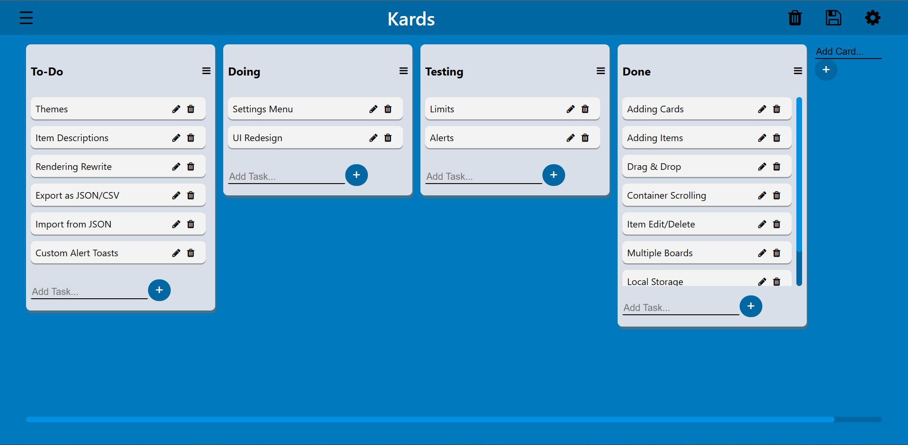

# Kards - Simple Kanban Board

  

## [Demo](https://waterrmalann.github.io/kards/)   |   [Source](https://github.com/waterrmalann/kards/blob/main/js/main.js)

A simple cards-based kanban board web app heavily inspired by Trello, the UI is also pretty similar to that of Trello. You can create upto 512 unique kanban boards with different names, which holds cards. Each card can hold an unlimited number of items/tasks each. All items support drag and drop between cards as well as within the same card to reoder. All data is stored locally on the computer by the browser. This whole project was written in HTML, CSS, and pure vanilla JavaScript with no external dependencies.



---

### Setup

A live version of the web app is available on my github pages [here](https://waterrmalann.github.io/kards/). Another version (could be outdated) is hosted on my personal portfolio at this [link](http://alanvarghese.me/projects/kards/app.html). If you wish to modify the app or host it yourself, you can clone the repo and do whatever you want with it.

1. [Clone the repository](https://docs.github.com/en/github/creating-cloning-and-archiving-repositories/cloning-a-repository-from-github/cloning-a-repository).
```
git clone https://github.com/waterrmalann/kards.git
```
2. Install the dependencies.
```
npm install
```
3. This will start a live server. Head to the IP shown in the console.
```
npm run serve
```

---

### Contribution

Contributions are always accepted. Feel free to open a pull request to fix any issues or to make improvements you think that should be made. Any contribution will be accepted as long as it doesn't stray too much from the objective of the app. If you're in doubt about whether the PR would be accepted or not, you can always open an issue to get my opinion on it.

License
----

MIT License, see [LICENSE](LICENSE)
